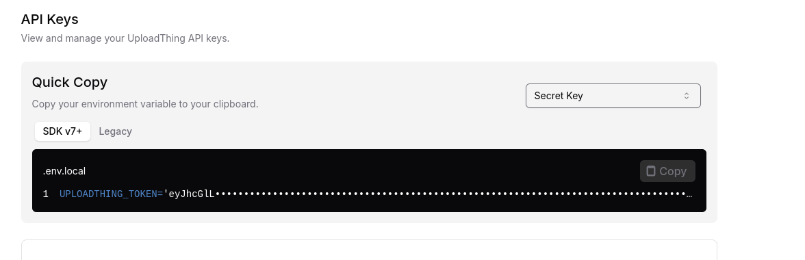

# Project Setup

## Overview
This document provides step-by-step instructions for configuring and running the application in both development and production environments. Follow these steps to ensure the application is set up correctly.

---

## Configuration

### `.env` File Setup
Copy the following configurations into a `.env` file located at the root of your project:

```env
UPLOADTHING_TOKEN=
```
To get UPLOADTHING_TOKEN:

1. **Access GitHub**: Go to [GitHub](https://uploadthing.com), and login with your github account
2. **Create an app**
3. **Copy Token**: 

   

To install rabbitmq:

1. **Window**: Go to [Window Install](https://www.rabbitmq.com/docs/install-windows) and follow the guide on official website, using wsl2 is preferable.
2. **Linux/WSL2**: Go to [Linux Install](https://www.rabbitmq.com/docs/install-debian) and follow the guide or:
    
   ```bash
    sudo apt-get update
    sudo apt-get install rabbitmq-server
   ```
    - **Check RabbitMQ status**:

   ```bash
    sudo systemctl status rabbitmq-server
   ```

    - **Expected result**:

   ```bash
    rabbitmq-server.service - RabbitMQ broker
    Loaded: loaded (/lib/systemd/system/rabbitmq-server.service; enabled; vendor preset: enabled)
    Active: active (running) since Tue 2025-01-11 10:00:00 UTC; 1min 5s ago
   ```

    - **Enable service**:

   ```bash
    sudo systemctl enable rabbitmq-server
    sudo systemctl start rabbitmq-server
   ```

3. **MacOS(Brew)**: Go to [MacOS Install](https://www.rabbitmq.com/docs/install-homebrew) and follow the guide.

---

## Running the Application

### Development Mode
To run the application in development mode:

1. Install dependencies:

   ```bash
   npm install
   ```

2. Start the development server:

   ```bash
   npm run dev
   ```

The server will be accessible at `http://localhost:3001`.

### Production Mode
To run the application in production mode:

1. Build the application:

   ```bash
   npm run build
   ```

2. Start the production server:

   ```bash
   npm start
   ```

The server will be accessible at `http://localhost:3001`.

---
